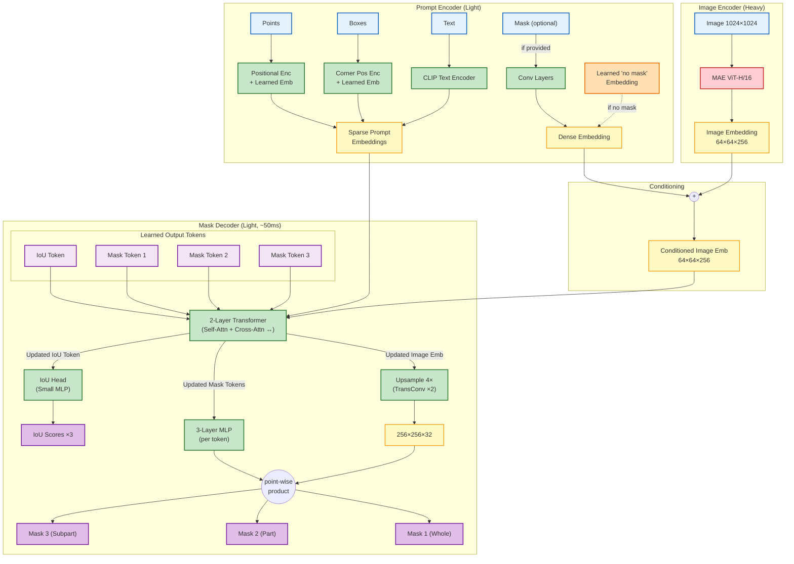
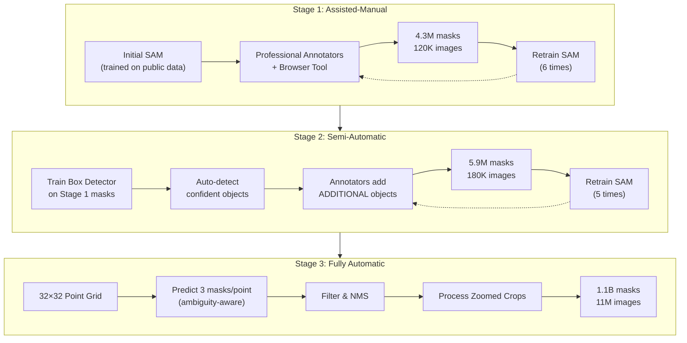

import Comments from "../../components/Comments";

## Introduction

SAM is a big collection of models published by Meta AI and it aims to segment components from contents.
It originally started with image segmentation but gradually expanded to video, [3D geometry](https://ai.meta.com/sam3d/) and [audio](https://ai.meta.com/samaudio/).

In this post, we will focus on the image and video segmentation models.
Segmentation is a quite classic task in computer vision and it has been extensively studied for decades.
But SAM series models revolutionized the field in following ways:

1. From expert model to foundation model:
   Traditional segmentation models are usually trained for a specific task or dataset.
   SAM introduced a "Promptable Segmentation" task and does not require any fine-tuning for zero-shot segmentation.
2. Unprecedented dataset scale and strong generalization ability:
   Previous models are usually trained on about ~100k images and ~1M masks.
   SAM v1 is trained on 11M images and 1.1B masks, which exceeds the scale of previous datasets by more than 100x.

The SAM series models are evolving over time and here is a summary of the key facts:

| Version                         | Goal / Task                                                                                                                                                                                                                               | Key Contributions                                                                                                                                                                                                                                                                                                                                          |
| :------------------------------ | :---------------------------------------------------------------------------------------------------------------------------------------------------------------------------------------------------------------------------------------- | :--------------------------------------------------------------------------------------------------------------------------------------------------------------------------------------------------------------------------------------------------------------------------------------------------------------------------------------------------------- |
| **SAM** (Segment Anything) | **Promptable Segmentation Task** To return a valid segmentation mask given any prompt (point, box, mask, text) on a static image. Aimed at zero-shot generalization to new distributions.                                            | • **Model:** Proposed the SAM architecture (Heavy Image Encoder + Light Prompt Encoder/Mask Decoder) for real-time interaction. • **Data:** Created **SA-1B** dataset (11M images, 1.1B masks) using a 3-stage data engine (Manual $\rightarrow$ Semi-Auto $\rightarrow$ Fully Auto).                                                                 |
| **SAM 2**                       | **Promptable Visual Segmentation (PVS)** To unify image and video segmentation. Extends the "segment anything" capability to video by maintaining temporal consistency and handling object occlusions/re-appearance.                 | • **Model:** Introduced a streaming architecture with **Memory Attention** and a **Memory Bank** to condition outputs on past frames. • **Data:** Created **SA-V** dataset (51K videos, 642K masklets) using a model-in-the-loop data engine. • **Performance:** Faster (6x speedup over SAM) and more accurate in both image and video domains. |
| **SAM 3**                       | **Promptable Concept Segmentation (PCS)** To segment _all_ instances matching a specific concept (text phrase or visual exemplar) in images and videos. Moving from "segment one specific target" to "segment all matching targets". | • **Model:** Introduced a decoupled architecture with a **Detector** (for recognition) and **Tracker** (from SAM 2), plus a **Presence Head** to separate recognition from localization. • **Data:** Created **SA-Co** dataset (1.7B image-concept pairs) with 4M+ unique concepts specific to semantic understanding.                                |

## SAM v1: Promptable Segmentation and Scalable Data Generation

### Define the task

To serve as a fundation model in image segmentation, it should have strong capability of generalization.
For this purpose, the authors defined a "Promptable Segmentation" task: given an image and a prompt, the model should return the segmentation result.

  
  
SAM produces high-quality masks for all objects in an image.

To achive this goal, there two main issues to resolve:

1. What is the architecture of the model?
   It should be able to process both the image and the prompts and efficiently interact with the prompts.
2. How to generate sufficient high quality training data and train the model?
   High quality training data is critical and very scarce before this work.
   This work designed a model-in-the-loop data engine and iteratively generate data and train the model.
3. How to deal with the ambiguity of the prompts?
   A point on a human face can mean both the face or the entire body.
   To deal with this ambiguity, the authors proposed to predict multiple candidate masks for each prompt.

### SAM v1 model architecture

**Remarks:**

- Image Encoder module:
  - At the training time, the parameters in the image encoder are learnable. Based on empirical observation of MAE-pretrained ViT-H/16,
    finetuning(make the parameter learnable) can yield much better performance than linear probing(freeze the parameters and use encoder as fixed feature extractor).
- Prompt Encoder module:
  - For **text**, the authors use a **frozen CLIP Text Encoder** for zero-shot text-to-mask transfer.
    - **Training:** Since SA-1B has no text, they use the **CLIP Image Encoder** (frozen) on random crops around masks to generate "pseudo-text" prompt embeddings.
    - **Inference:** They use the **CLIP Text Encoder** (frozen) on the input text. Because CLIP aligns image and text spaces, this works zero-shot without explicit text supervision.
- Mask Decoder module:
  - There are 4 learned tokens (1 IoU + 3 Mask) that act as "queries". Initially identical for all inputs, they gather information from the image and prompts via the Transformer's attention mechanism.
    They can be percieved as [CLS] tokens or registers in ViT.
    I **did not find** any part in the paper that indicates that each of this output token is represent "query" to a specific output mask. For example, learned output token 1 represent query for "whole object" mask.
    Therefore, I think it does not matter a lot if there is 3, 4, 5, or even 6 output tokens.
  - The transformer module inside the mask decoder combines the self-attention and cross-attention. My understanding about [the architure is this](https://mermaid.ai/play?utm_source=mermaid_live_editor&utm_medium=share#pako:eNqdk99u2jAUxl_FOldFCjR2QgLWVIkxLlC7hil0F1umyRDzRyN2lDhaGWWXe4A-4p5kTgw0adEq1Vc59ved88uXeAdzGXOgsMxYukLT95FAeuXFzGyMRVqo3GyWK5h-jSAolN5FU_mDi_zdLLu8unAtRLpeK4JvT9pJqZ1kMkmb2t_EPqMej7R6nLAlR6Nkduhq971nUi7iSDyDjGAoxZypCOqgqN2-QtPgenQb6s4GAF0YZetIcp67Zv3f1FDxFGGKQr5ZtAdKcaHWUtQpTI-qXTjQFE2lgTiQBWKzbXKEgxoH0e67NGaKx2WY-SuBVGiEomEm87ycKFA56O-fx3GybL1EJNWoh08PaDjAetTJd3ynxpcy4mvrcyV_OtFFDdl5A7JD0cebyUs-p-qrj8pfSq6Fav9c59xoa2i6rgG4bwBwm5nptHRm2tzI7JhAFRd5Ja4DSyMzUs_MZD8efQ_upjViPbq8Ceeg6y2NSUOiW36v0A3b8uzkMU2POrD0NV_HQFVWcAsSniWsLGFXqiNQK57wCKh-jPmCFZvqRu21LWXii5TJ0ZnJYrkCumCbXFdFBfxhzXSQJwkrlAy3Yn6yaHyeDWUhFFC_R6qeQHdwD9Qh_U7f7_V8z8Z9gl3Xgi3QNsZOx8Nez-l6Xc_2XUL2FvyqMHDH9u2-7fdsgm0b-5js_wEMOGJf).

### Data Engine and training recipe

The final dataset the paper generated has more than 1.1B masks and it is impossible to manually label all of them _(napkin math: 1.1B\* 50s per mask(estimated in the paper) = 1500 years)_.
In this paper, the authors proposed a model-in-the-loop(MITL) style training strategy to iteratively train the model and generate dataset.
It started the training with some public segmentation datasets (the paper did not specify, but I assume it is COCO, LVIS, etc) and obtained an very initial version of SAM.
Then iteratively generate masks, annotate them with human annotators, and retrain the model.
Detailed process is shown in the figure below.

  

    <h4>Stage 1: Assisted-Manual</h4>
    

      <b>Focus:</b> Human-in-the-loop
    

    

      <b>Input:</b> Initial SAM trained on public datasets
    

    

      <b>Process:</b>
    

    <ul>
      <li>Professional annotators use browser-based tool</li>
      <li>Click fg/bg points → SAM predicts mask</li>
      <li>Refine with brush/eraser</li>
    </ul>
    

      <b>Feedback:</b> Retrain SAM 6 times (ViT-B → ViT-H)
    

    

      <b>Output:</b> 4.3M masks / 120K images
    

  

  

    <h4>Stage 2: Semi-Automatic</h4>
    

      <b>Focus:</b> Diversity
    

    

      <b>Input:</b> SAM + Box Detector
    

    

      <b>Process:</b>
    

    <ul>
      <li>Auto-detect confident objects</li>
      <li>
        Annotators add <b>additional objects</b>
      </li>
    </ul>
    

      <b>Feedback:</b> Retrain SAM 5 times
    

    

      <b>Output:</b> 5.9M new masks / 180K images (10.2M total)
    

  

  

    <h4>Stage 3: Fully Automatic</h4>
    

      <b>Focus:</b> Scale (Zero human effort)
    

    

      <b>Input:</b> SAM with ambiguity-aware output
    

    

      <b>Process:</b>
    

    <ul>
      <li>32×32 point grid prompt</li>
      <li>Predict 3 masks/point</li>
      <li>Filter by IoU/Stability/NMS</li>
    </ul>
    

      <b>Feedback:</b> None
    

    

      <b>Output:</b> 1.1B masks / 11M images
    

  

## SAM v2:

<Comments />

## Reference
