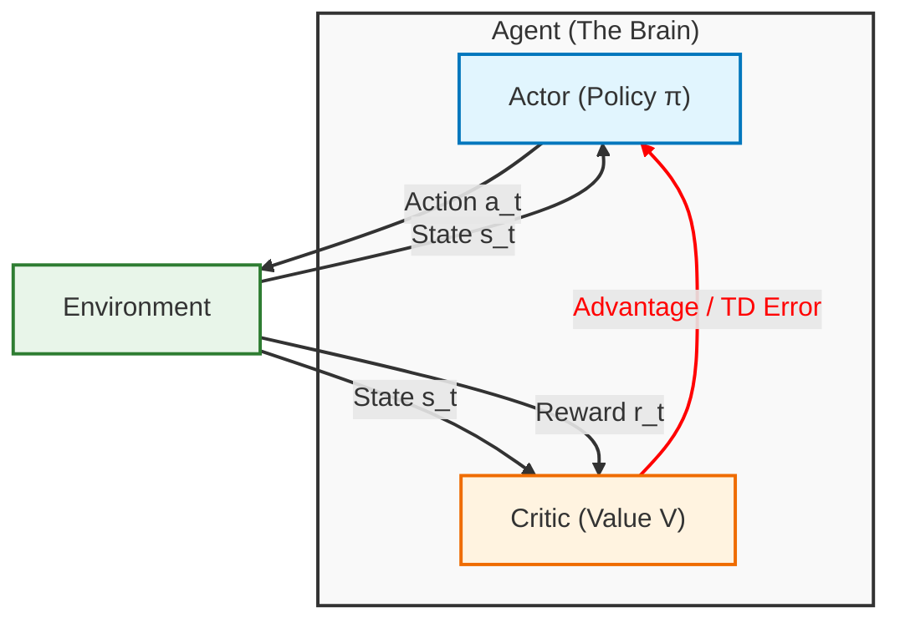
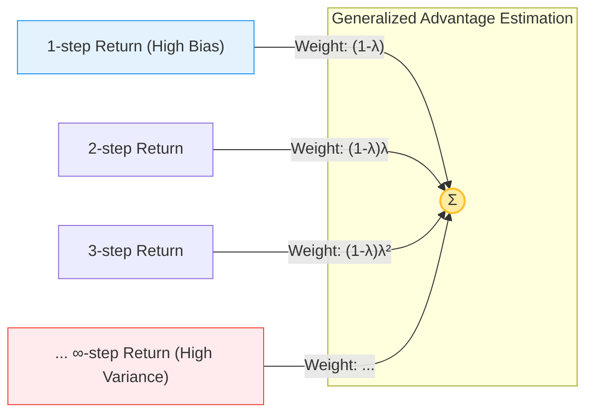

## 1. Introduction and Motivation

In previous notes, we explored [**Policy Gradient (PG)** methods](./rl-note-i-policy-gradient) (e.g., REINFORCE). While elegant and capable of handling continuous action spaces, PG methods suffer from a significant drawback: **high variance**.
The gradient of the reinforcement learning objective $J(\theta)$ is given by:

$$
\begin{equation}
\nabla_\theta J(\theta) \approx \frac{1}{N} \sum_{i=1}^N \sum_{t=0}^T \nabla_\theta \log \pi_\theta(a_{i,t} | s_{i,t}) \hat{Q}_{i,t}
\end{equation}
$$

Where $\hat{Q}_{i,t}$ is an estimate of the return (reward to go). In REINFORCE, we use the Monte Carlo estimate (the actual sum of rewards observed in the rollout). Because trajectories can vary wildly due to stochasticity in the environment and policy, this estimate has very high variance, leading to unstable training and poor sample efficiency.

**Actor-Critic** algorithms aim to reduce this variance by replacing the high-variance Monte Carlo return with a lower-variance function approximator (the **Critic**).

## 2. The Actor-Critic Architecture

An Actor-Critic algorithm consists of two components:

1.  **The Actor ($\pi_\theta(a|s)$):** The policy that controls how the agent acts. It tries to maximize the expected return.
2.  **The Critic ($V_\phi(s)$):** A value function that estimates the expected return of the current policy. It evaluates the actor's actions.

### 2.1. The One-Step Actor-Critic Algorithm

The interaction between the Actor and Critic creates a cycle where the Actor generates usage data, and the Critic learns from this data to provide better updates for the Actor.

Below is the standard **One-Step Actor-Critic** algorithm (online, episodic). Notice how the Critic's value estimate $V(s)$ is used to compute the TD-error $\delta$, which then drives the updates for **both** the Actor and the Critic.

$$
\begin{array}{l}
\hline
\textbf{Algorithm 2} \text{ One-step Actor-Critic (Episodic)} \\
\hline
\textbf{Input: } \text{differentiable policy } \pi_\theta(a|s), \text{ differentiable value function } V_\phi(s) \\
\textbf{Parameters: } \text{step sizes } \alpha, \beta > 0 \\
\textbf{Initialize: } \text{policy parameters } \theta \text{ and value weights } \phi \text{ arbitrarily} \\
\textbf{for } \text{each episode do} \\
\quad \text{Initialize } S \text{ (first state of episode)} \\
\quad \textbf{while } S \text{ is not terminal do} \\
\quad \quad \text{Sample action } A \sim \pi_\theta(\cdot|S) \\
\quad \quad \text{Take action } A, \text{ observe reward } R, \text{ and next state } S' \\
\quad \quad \text{Compute TD Error: } \delta \leftarrow R + \gamma V_\phi(S') - V_\phi(S) \quad \text{(if } S' \text{ is terminal, } V_\phi(S')=0 \text{)} \\
\quad \quad \textbf{Update Critic (Policy Evaluation):} \\
\quad \quad \quad \phi \leftarrow \phi + \beta \delta \nabla_\phi V_\phi(S) \\
\quad \quad \textbf{Update Actor (Policy Improvement):} \\
\quad \quad \quad \theta \leftarrow \theta + \alpha \delta \nabla_\theta \log \pi_\theta(A|S) \\
\quad \quad S \leftarrow S' \\
\quad \textbf{end while} \\
\textbf{end for} \\
\hline
\end{array}
$$

### 2.2. Policy Evaluation (Training the Critic)

The Critic's role is to evaluate the current policy $\pi_\theta$ by estimating the value function $V(s)$. To perform the **Update Critic** step shown above, we treat Policy Evaluation as a regression problem. The critic minimizes the Mean Squared Error (MSE) between its prediction $V_\phi(s)$ and a target value $y_t$.

$$
\begin{equation}
\mathcal{L}(\phi) = \frac{1}{2} \| V_\phi(s_t) - y_t \|^2
\end{equation}
$$

The gradient of this loss determines the update direction: $\nabla_\phi \mathcal{L} = -(y_t - V_\phi(s_t)) \nabla_\phi V_\phi(s_t)$.
In the algorithm above, the term $(y_t - V_\phi(s_t))$ corresponds exactly to the TD error $\delta$ when using the **Bootstrapped Target**.

#### 2.2.1. The Choice of Target: Bias vs. Variance
The crucial difference between Actor-Critic and methods like REINFORCE lies in the choice of the target $y_t$.

*   **Monte Carlo Target (REINFORCE):** Uses the actual sum of rewards from the entire episode.
    $$
    \begin{equation}
    y_t^{MC} = \sum_{t'=t}^T r(s_{t'}, a_{t'})
    \end{equation}
    $$
*   **Bootstrapped (TD) Target (Actor-Critic):** Uses the immediate reward plus the *estimated* value of the next state.
    $$
    \begin{equation}
    y_t^{TD} = r(s_t, a_t) + \gamma V_\phi(s_{t+1})
    \end{equation}
    $$

Using the bootstrapped target introduces **bias** (because $V_\phi$ is initially an incorrect estimate) but significantly reduces **variance**.

> **Rigorous Variance Decomposition:**
>
> To understand mathematically why bootstrapping reduces variance, we can use the **Law of Total Variance** to decompose the variance of the full Monte Carlo return $G_t$. We condition on the random variables of the *immediate* step, $\tau_t = (s_t, a_t, r_t, s_{t+1})$:
>
$$
\begin{equation}
\text{Var}(G_t) = \underbrace{\text{Var}(\mathbb{E}[G_t | \tau_t])}_{\text{A: Immediate Variance}} + \underbrace{\mathbb{E}[\text{Var}(G_t | \tau_t)]}_{\text{B: Future Variance}}
\end{equation}
$$
>
> *   **Term A (Immediate Variance):** The variance arising from the randomness of the *current* step (action choice $a_t$, immediate reward $r_t$, and transition to $s_{t+1}$).
    $$
    \begin{equation}
    \text{Term A} = \text{Var}(r_t + \gamma V_{\text{true}}(s_{t+1}))
    \end{equation}
    $$
> *   **Term B (Future Variance):** The expected variance of the rewards from time $t+1$ onwards. In Monte Carlo, this sums up the noise of every future coin flip (stochastic actions and transitions) for the rest of the episode. This term is **positive and typically large** for long horizons.
>
> **The Actor-Critic Advantage:**
> By using the TD target $y_t^{TD} = r_t + \gamma V_\phi(s_{t+1})$, we are effectively **choosing to ignore Term B**. We replace the highly variable future return $G_{t+1}$ with its deterministic expectation $V_\phi(s_{t+1})$ (assuming our critic is accurate).
>
> Thus, the Critic **"cuts off" the accumulation of noise** from the future, leaving only the variance from the immediate step (Term A). This leads to strictly lower variance updates, ensuring more stable training.

### 2.3. Policy Improvement (Training the Actor)

The actor is updated using the approximate advantage calculated by the critic.

$$
\begin{equation}
\nabla_\theta J(\theta) \approx \frac{1}{N} \sum_{i=1}^N \sum_{t=0}^T \nabla_\theta \log \pi_\theta(a_{i,t} | s_{i,t}) \hat{A}(s_{i,t}, a_{i,t})
\end{equation}
$$

Where the advantage estimate $\hat{A}$ is often approximated using the temporal difference error (TD-error):

$$
\begin{equation}
\hat{A}(s_t, a_t) \approx r(s_t, a_t) + \gamma V_\phi(s_{t+1}) - V_\phi(s_t)
\end{equation}
$$

### 2.4. The Challenge of Off-Policy Actor-Critic

A common question is: **"Can we just use a Replay Buffer to train Actor-Critic?"** to improve sample efficiency.

*   Directly training the policy on old samples (transitions from a buffer) is **mathematically incorrect** for standard Policy Gradient because the gradient requires samples from the *current* policy distribution $\pi_\theta$.
*   Using old samples introduces **distribution shift**, meaning the gradient estimate is no longer valid for the current policy.
*   Naive "Off-Policy AC" that treats old samples as current samples is often considered "broken". Correct Off-Policy algorithms require specific corrections (e.g., importance sampling) to handle this mismatch.

## 3. Bias-Variance Tradeoff and N-Step Returns

The choice of target for the critic dictates the bias-variance tradeoff:

*   **Monte Carlo (REINFORCE):** Unbiased, High Variance.
*   **One-step Actor-Critic:** Biased (if Critic is imperfect), Low Variance.

*   **Discount Factor $\gamma$ as Variance Reduction:**
    *   Lower $\gamma$ (ignoring far-future rewards) significantly reduces variance but introduces bias (we optimize for a "myopic" horizon).
    *   High $\gamma$ (near 1) is unbiased (w.r.t true objective) but has high variance.

### 3.1. Variance Comparison

The concept of "cutting off" the variance is visualized below:

To understand *why* the Critic reduces variance, let's compare the variance of the Monte Carlo return ($G_t$) versus the Bootstrapped TD Target ($y_t$).

**1. Variance of Monte Carlo Return ($G_t$):**
The MC return is the sum of all future discounted rewards. Assuming rewards at each step are independent random variables with variance $\sigma^2$:

$$
\begin{equation}
G_t = \sum_{k=0}^\infty \gamma^k r_{t+k}
\end{equation}
$$

$$
\begin{equation}
\text{Var}(G_t) = \text{Var}\left( \sum_{k=0}^\infty \gamma^k r_{t+k} \right) \approx \sum_{k=0}^\infty \gamma^{2k} \text{Var}(r_{t+k}) = \sum_{k=0}^\infty \gamma^{2k} \sigma^2 = \frac{\sigma^2}{1-\gamma^2}
\end{equation}
$$

Even with discounting, this variance accumulates from *every* future time step.

**2. Variance of TD Target ($y_t$):**
The one-step TD target only involves the immediate reward $r_t$ and the estimated value of the next state $V(s_{t+1})$.

$$
\begin{equation}
y_t = r_t + \gamma V(s_{t+1})
\end{equation}
$$

$$
\begin{equation}
\text{Var}(y_t) = \text{Var}(r_t) + \gamma^2 \text{Var}(V(s_{t+1}))
\end{equation}
$$

If the value function $V$ is a good estimator (or effectively constant/learned), its variance is typically much lower than the sum of all future reward variances.

$$
\begin{equation}
\text{Var}(y_t) \ll \text{Var}(G_t)
\end{equation}
$$

Essentially, we replace the "infinite tail" of variance ($\sum_{k=1}^\infty \dots$) with the single term variance of our estimator $\text{Var}(V)$.

We can interpolate between these using **n-step returns**:

$$
\begin{equation}
\hat{A}_n(s_t, a_t) = \sum_{k=0}^{n-1} \gamma^k r_{t+k} + \gamma^n V_\phi(s_{t+n}) - V_\phi(s_t)
\end{equation}
$$

### 3.2. Generalized Advantage Estimation (GAE)

Instead of choosing a single $n$ (which is a hard hyperparameter to tune), Schulman et al. (2015) proposed **GAE**, which computes an **exponentially weighted average** of all possible n-step returns.

The key insight is to define the **TD error** at time $t$ as:
$$
\begin{equation}
\delta_t = r_t + \gamma V(s_{t+1}) - V(s_t)
\end{equation}
$$
This $\delta_t$ is actually the bias-corrected estimate of the advantage for just one step.

The **GAE Estimator** $\hat{A}^{GAE}_t$ is defined as the sum of discounted TD errors:
$$
\begin{equation}
\hat{A}^{GAE}_t = \sum_{l=0}^\infty (\gamma \lambda)^l \delta_{t+l}
\end{equation}
$$

#### Why is this useful?
1.  **$\lambda$ as a Knob:** The parameter $\lambda \in [0, 1]$ allows us to smoothly interpolate between the high-bias TD target and the high-variance MC return.
    *   **$\lambda = 0$:** $\hat{A}_t = \delta_t$. This is equivalent to **TD(0)** (low variance, high bias).
    *   **$\lambda = 1$:** $\hat{A}_t = \sum \gamma^l \delta_{t+l} = \sum \gamma^l r_{t+l} - V(s_t)$. This is equivalent to **Monte Carlo** (high variance, unbiased).
2.  **Robustness:** By averaging multiple k-step returns, we are less sensitive to the specific choice of exactly "how many steps" to look ahead.

#### Implementation Note
We don't actually compute infinite sums. We compute GAE efficiently by iterating **backwards** from the end of the trajectory:
$$
\begin{equation}
\hat{A}^{GAE}_t = \delta_t + (\gamma \lambda) \hat{A}^{GAE}_{t+1}
\end{equation}
$$
This recursive form is $O(T)$ and very easy to implement in code.
